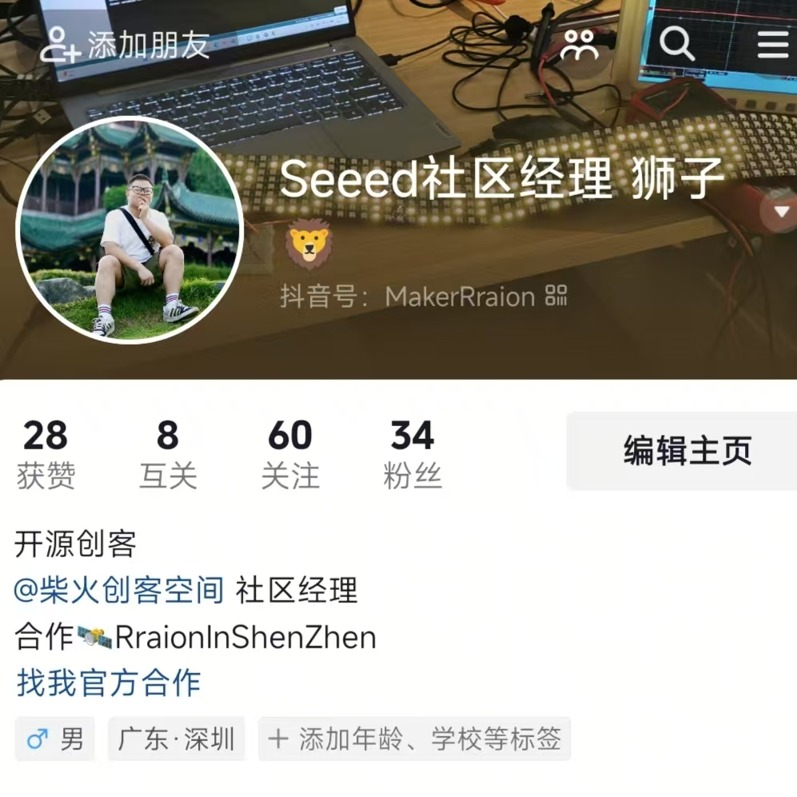
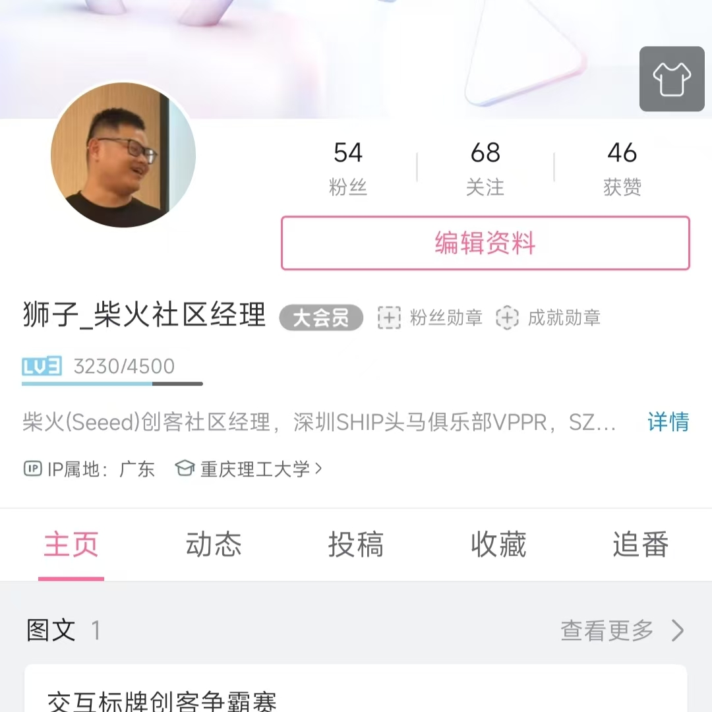
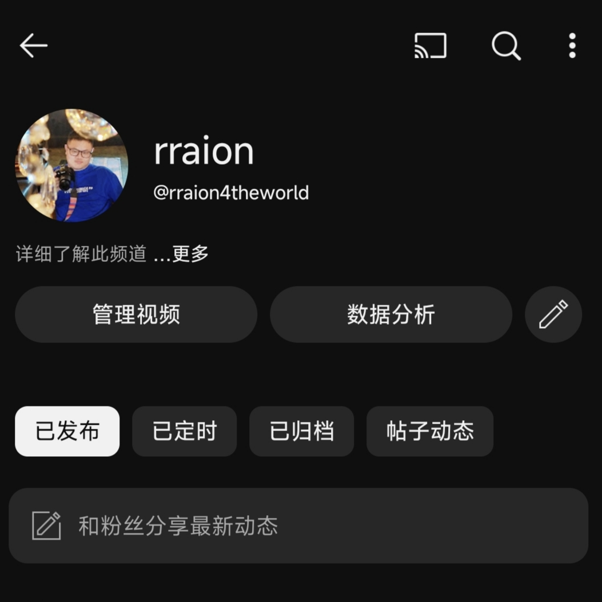

---
social:
  cards_layout_options:
    background_color: blue # Change background color
    background_image: null # Remove background image
---

## 找到🦁

  

    <!-- 第一行 -->

  <a href="https://www.douyin.com/user/MS4wLjABAAAAa-aFDBgBi9vwKN5Qb-S166nXqGuGiXixRS9dMs1H3_yIf4DjVXHouvgHb1Ia772v?from_tab_name=main" class="social-card" data-img="douyin.jpg">
    
    

      <h3 class="card-title">抖音</h3>
      
MakerRraion

    

  </a>

  <a href="https://space.bilibili.com/3546647762045462?spm_id_from=333.1007.0.0" class="social-card" data-img="bilibili.jpg">
    
    

      <h3 class="card-title">BiliBili</h3>
      
3546647762045462

    

  </a>

  <a href="https://www.linkedin.com/in/%E5%B2%A9%E6%9D%BE-%E6%B1%AA-7a469b357/?locale=en_US" class="social-card" data-img="linkin.jpg">
    
    

      <h3 class="card-title">LinkedIn</h3>
      
Rraion Wang

    

  </a>

  <a href="https://www.youtube.com/@rraion4theworld" class="social-card" data-img="youtube.jpg">
    
    

      <h3 class="card-title">YouTube</h3>
      
@rraion4theworld

    

  </a>

  

## 讨论区

👋 Hello，欢迎大家讨论，我们的话题包括但不限于

- 在使用技术中的任何疑问
- 你觉得有意思可以上榜的项目
- 仓库的PR..

<!-- 
## 项目列表
|名称|地址|说明|
|-|-|-|
|R2HUB75|[点击跳转](https://rraionwang.github.io/开源项目/R2HUB75/R2HUB75/)|使用ESP32+HUB75做好玩的交互项目|
 -->
