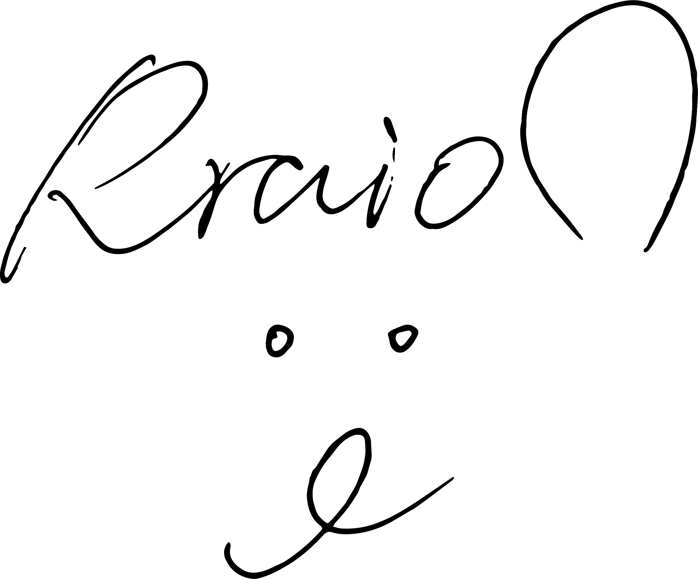

# 个人简介

 
<h1> [Seeed](https://www.seeedstudio.com/)[柴火开源社区](https://www.chaihuo.org/)经理 </h1>

 
<h1> 深圳[SHIP头马俱乐部](https://www.toastmasters.org/Find-a-Club/00982065-ship-toastmasters-club)会员</h1>

 
<h1> 深圳[SZDIY](https://szdiy.org/)会员 </h1>

# Rraion是什么意思?
其实Rraion是狮子的英文名字啦

首先悄咪咪告诉大家Rraion的标准读音，参考如下：

<audio controls>
  <source src="assets/name_record.MP3" type="audio/mp3">
  您的浏览器不支持音频播放。
</audio>

那么至于为什么是这样的读音呢？

狮子的英文是Lion，变体有Leon，Leo等等，但是这些名字已经烂大街了，所以我想独特一点。

故使用西班牙语的rr代替l，这样就会变成rrion。

但是rrion同英语lion的读音有比较大的差异，所以添加了一个a。

于是就变成了Rraion。

当然如果你不会读颤音那么就读lion/ryan都OK啦。

当然中文就叫我狮子或者小狮子就ok咯，如果可爱一点也可以读西几哈哈。🦁

