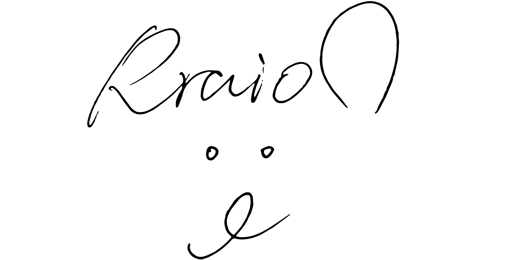

# 个人简介

## 兴趣
目前来说就是比较喜欢用esp32做些很mini很酷的小玩意咯

## 签名

👆狮子签名，是不是很好看

***

## Rraion是什么意思?
其实Rraion是狮子的英文名字啦

首先悄咪咪告诉大家Rraion的标准读音，参考如下：

<audio controls>
  <source src="assets/name_record.MP3" type="audio/mp3">
  您的浏览器不支持音频播放。
</audio>

那么至于为什么是这样的读音呢？

狮子的英文是Lion，变体有Leon，Leo等等，但是这些名字已经烂大街了，所以我想独特一点。

故使用西班牙语的rr代替l，这样就会变成rrion。

但是rrion同英语lion的读音有比较大的差异，所以添加了一个a。

于是就变成了Rraion。

当然如果你不会读颤音那么就读lion/ryan都OK啦。

当然中文就叫我狮子或者小狮子就ok咯，如果可爱一点也可以读西几哈哈。🦁

## 和狮子做朋友
微信 RraionInShenZhen,好友验证备注github

## 寻找工作机会
请参见内推页

