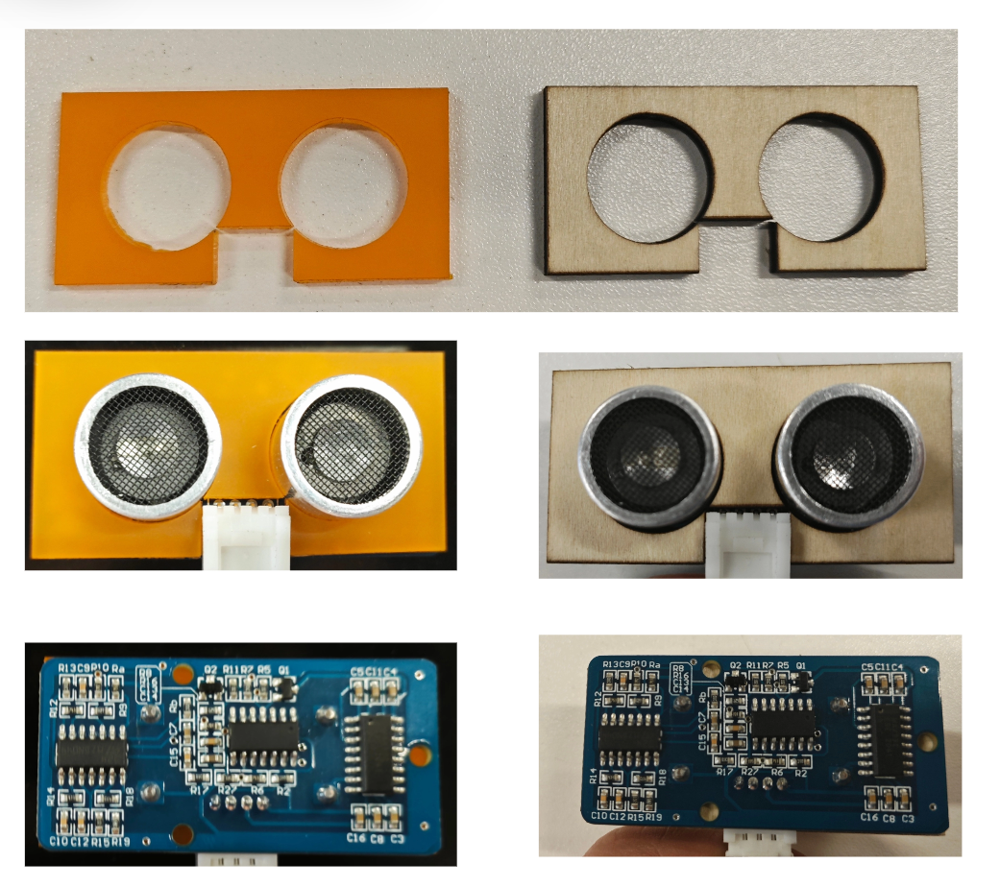

# 超声波距离传感器

## 尺寸图

## 下载
|文件|下载|说明|
|-|-|-|
|dxf文件|[seeed_ultrasonic_sensor_dxf.dxf](seeed_ultrasonic_sensor_dxf.dxf)||
|FCStd文件|[seeed_ultrasonic_sensor.FCStd](seeed_ultrasonic_sensor.FCStd)|用于测试|

## 效果预览
在这里给大家提供了我自己切割的3mm椴木版以及3mm的亚克力版

