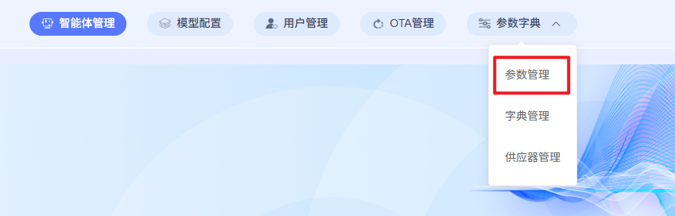
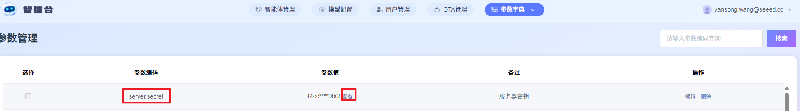
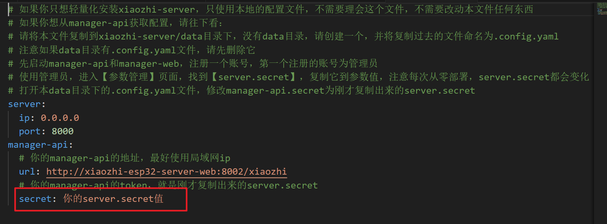
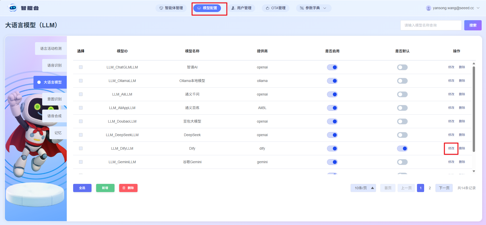
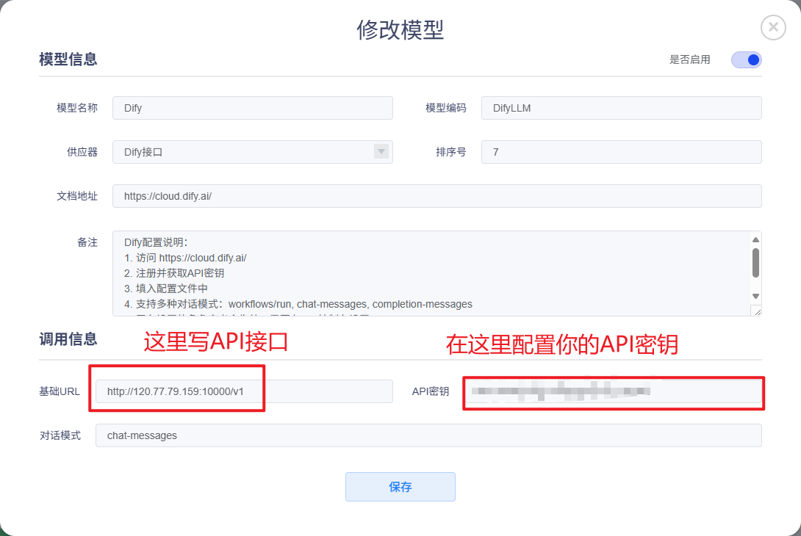
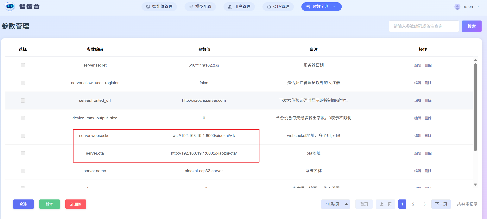

# Docker本地部署小智服务器

## 参考和鸣谢
感谢虾哥开源[小智后端](https://github.com/78/xiaozhi-esp32?tab=readme-ov-file)

感谢xinnan-tech提供[本地部署教程](https://github.com/xinnan-tech/xiaozhi-esp32-server/blob/main/docs/Deployment_all.md#%E6%96%B9%E5%BC%8F%E4%BA%8C%E6%9C%AC%E5%9C%B0%E6%BA%90%E7%A0%81%E8%BF%90%E8%A1%8C%E5%85%A8%E6%A8%A1%E5%9D%97)


## 前置条件
1. 一台内存>=8G的服务器
2. 预装docker

## 步骤
1. 下载[本文件夹](./xiaozhi-server.zip)解压到本地
2. 下载[model.pt](https://modelscope.cn/models/iic/SenseVoiceSmall/resolve/master/model.pt)存放到第一步下载的文件夹中的`models/SenseVoiceSmall`下
3. 检查文件夹结构，`xiaozhi-server`的结构应为
```sh
xiaozhi-server
  ├─ docker-compose_all.yml
  ├─ data
    ├─ .config.yaml
  ├─ models
     ├─ SenseVoiceSmall
       ├─ model.pt
```
4. 使用docker清除之前构建的历史镜像以及容器（初次部署此步可跳过）
```sh
docker compose -f docker-compose_all.yml down

docker stop xiaozhi-esp32-server
docker rm xiaozhi-esp32-server

docker stop xiaozhi-esp32-server-web
docker rm xiaozhi-esp32-server-web

docker stop xiaozhi-esp32-server-db
docker rm xiaozhi-esp32-server-db

docker stop xiaozhi-esp32-server-redis
docker rm xiaozhi-esp32-server-redis

docker rmi ghcr.nju.edu.cn/xinnan-tech/xiaozhi-esp32-server:server_latest
docker rmi ghcr.nju.edu.cn/xinnan-tech/xiaozhi-esp32-server:web_latest
```

5. 启动新容器
执行`docker compose -f docker-compose_all.yml up -d`启动新容器

6. 访问控制台
使用`docker logs -f xiaozhi-esp32-server-web`命令查看日志，如果出现如下日志则说明智控台启动成功
```sh
2025-xx-xx 22:11:12.445 [main] INFO  c.a.d.s.b.a.DruidDataSourceAutoConfigure - Init DruidDataSource
2025-xx-xx 21:28:53.873 [main] INFO  xiaozhi.AdminApplication - Started AdminApplication in 16.057 seconds (process running for 17.941)
http://localhost:8002/xiaozhi/doc.html
```
此时使用`http://你的服务器ip:8002`就可以访问智控台
7. 注册账号
初次登录智控台需要进行账号注册

8. 将智控台的密钥复制到.config.yaml，进入【参数字典】>【参数管理】，复制server.secret字段的值
  
  
  粘贴到.config.yaml文件的这里
  

9. 配置大语言模型
  
  

10. 重启智控台
使用如下指令：
```sh
docker restart xiaozhi-esp32-server
docker logs -f xiaozhi-esp32-server
```
进行重启和查看日志，如果出现类似于
```sh
25-02-23 12:01:09[core.websocket_server] - INFO - Websocket地址是      ws://xxx.xx.xx.xx:8000/xiaozhi/v1/
25-02-23 12:01:09[core.websocket_server] - INFO - =======上面的地址是websocket协议地址，请勿用浏览器访问=======
25-02-23 12:01:09[core.websocket_server] - INFO - 如想测试websocket请用谷歌浏览器打开test目录下的test_page.html
25-02-23 12:01:09[core.websocket_server] - INFO - =======================================================
```
就表示server启动成功

11. 配置OTA和websocket地址
打开cmd使用`ipconfig`(win)或者`ifconfig`(linux)查看到自己的ip，假设ip为192.168.19.1，那么你的OTA接口和websocket接口就是

|接口|地址|
|-|-|
|OTA接口|http://192.168.19.1:8002/xiaozhi/ota/|
|Websocket接口|ws://192.168.19.1:8000/xiaozhi/v1/|
其他IP对应替换就可以



## FAQ

### 1. 使用docker启动小智服务器之后服务器宕机卡死
检查服务器内存是否<font color=red>>=8G</font>，如果不满足条件请加装内存

### 2. docker无法拉取镜像
使用docker国内镜像仓库或者魔法

## 3. windows进行docker部署产生错误
如果是Docker Desktop请先打开，然后进行部署

## 4. 服务器外部无法访问8002端口
请在服务器的防火墙打开对应端口