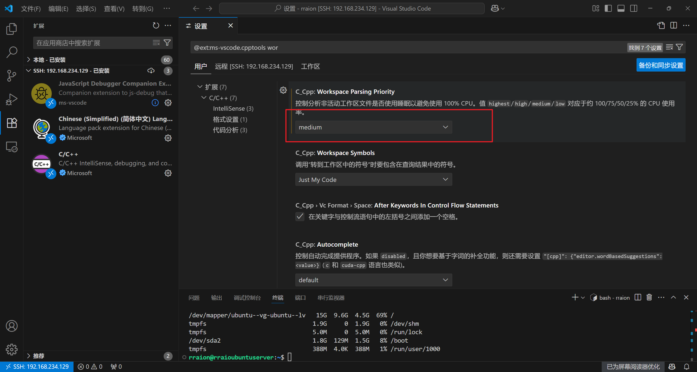

# 配置ESP-IDF Ubuntu开发环境(国内版)
## 致谢
本文章参考 
1. https://www.codeleading.com/article/83805664051/

## 1. 下载必要仓库
```sh
git clone https://gitee.com/EspressifSystems/esp-gitee-tools.git
git clone https://gitee.com/EspressifSystems/esp-idf.git

cd esp-gitee-tools
export EGT_PATH=$(pwd)
cd ..
cd esp-idf
$EGT_PATH/submodule-update.sh

sudo apt-get install git wget flex bison gperf python python-pip python-setuptools cmake ninja-build ccache libffi-dev libssl-dev dfu-util

# 安装编译工具链
cd esp-gitee-tools
export EGT_PATH=$(pwd)
cd ..
cd esp-idf
$EGT_PATH/install.sh

# 测试
. $HOME/esp-idf/export.sh
cd ~/esp-idf/examples/get-started/hello_world/
idf.py build
idf.py -p /dev/ttyS3 -b 115200 flash
idf.py -p /dev/ttyS3 -b 115200 monitor
```

## 2. 设置环境变量
```sh
vim ~/.profile 

# 末尾添加这一句
source /home/rraion/.esp/esp-idf/export.sh 
```

## 3. 设置VSCode插件
安装c/c++拓展以及esp-idf插件，如果遇到容量不足请参考这篇文章https://blog.csdn.net/zhaoxuelianok/article/details/145528276
将C/C++插件的CPU占用设置为中等


## 4. 设置串口权限
```sh
sudo usermod -aG dialout your_username 

#比如我的用户名是rraion那就是
sudo usermod -aG dialout rraion 

```

## 备注
1. 需要考虑权限的问题，一开始我将两个文件夹放到了/usr/share目录下，发现使用idf.py没有权限，使用sudo虚拟环境又不一样，解决方法是放到了/home/rraion/目录下，然后使用重新刷新了下编译链就好了。


