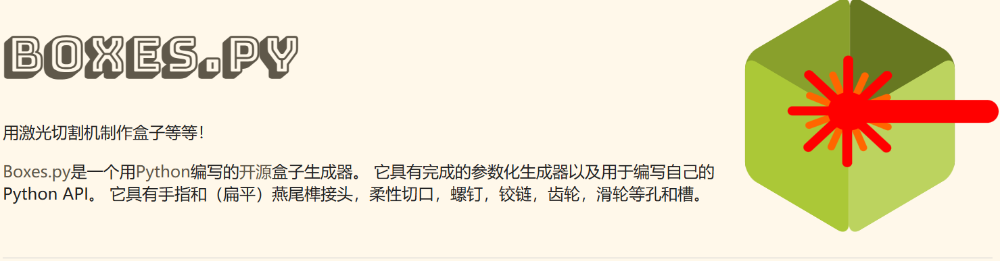
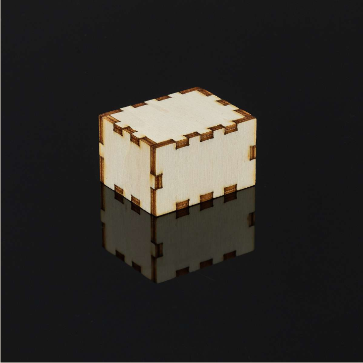
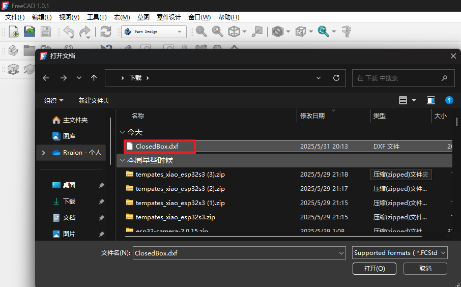
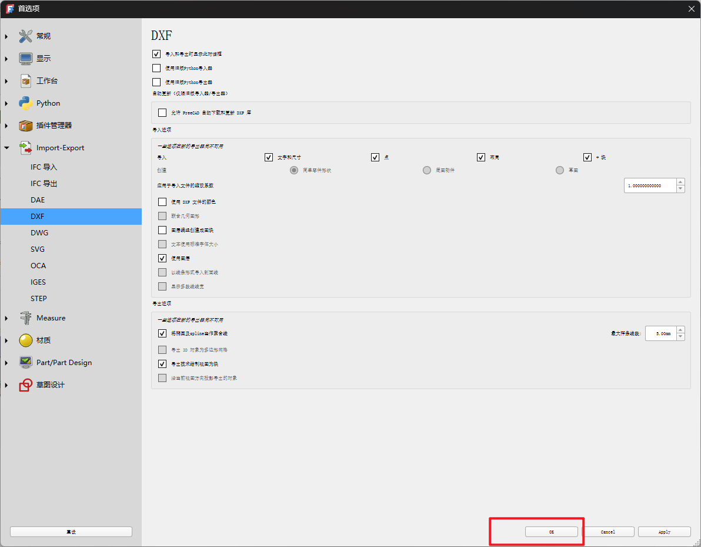
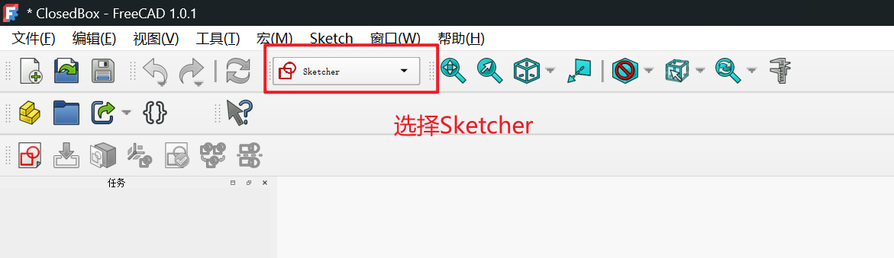
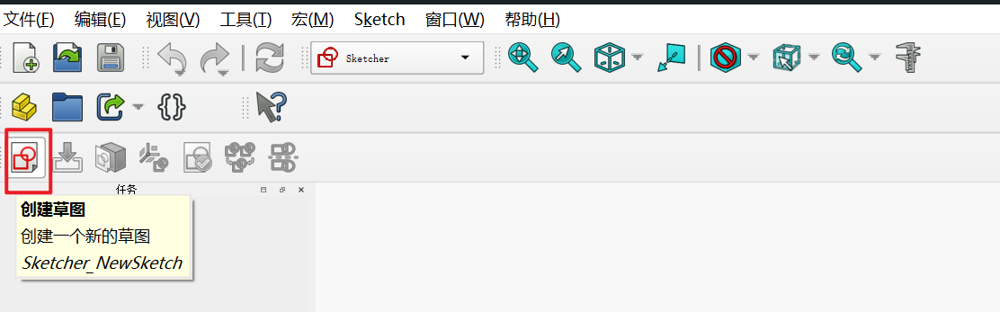
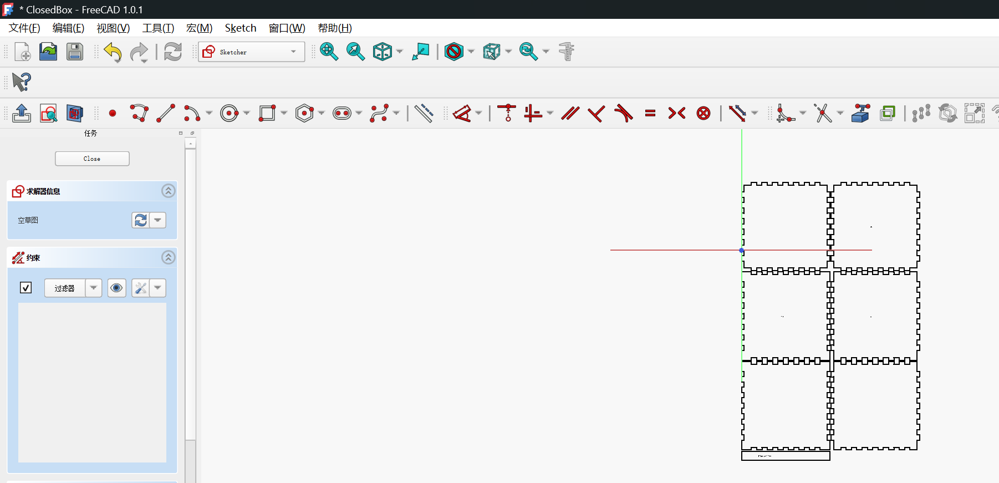
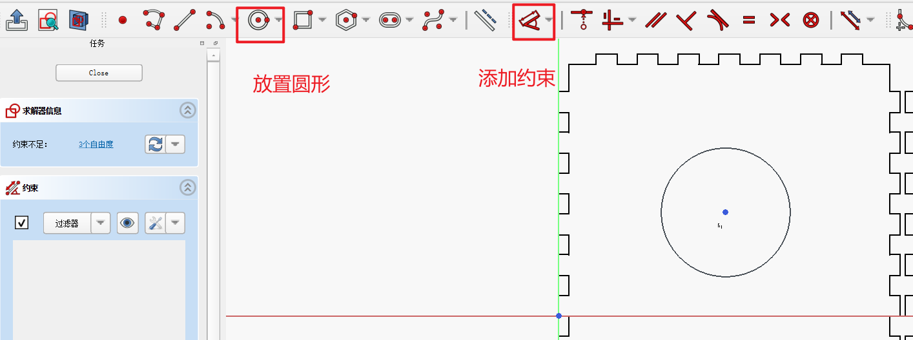

# 使用FreeCAD设计dxf文件

## 前言
当我们希望为自己的产品设计一些结构的时候，激光切割和3D打印是常见的方法，对于一些简单的结构，激光切割的速度远快于3D打印，本篇教程就介绍一下如何使用FreeCAD进行简单的dxf的设计

## 快速生成盒子dxf
首先[Boxes.py](https://boxes.hackerspace-bamberg.de/?language=zh_CN)这个网站可以很快速地生成盒子外观并且有多种选项。

我们选择最简单的六边形盒子作为例子

接下来我们会对盒子做一些定制化的设计。

## 使用FreeCAD打开下载的盒子dxf文件

点击创建草图之后，我们就会得到一个可以编辑的界面

假设我希望在盒子的每一个面的中心都添加一个圆孔，我们就可以放置一个圆形，并且添加约束

