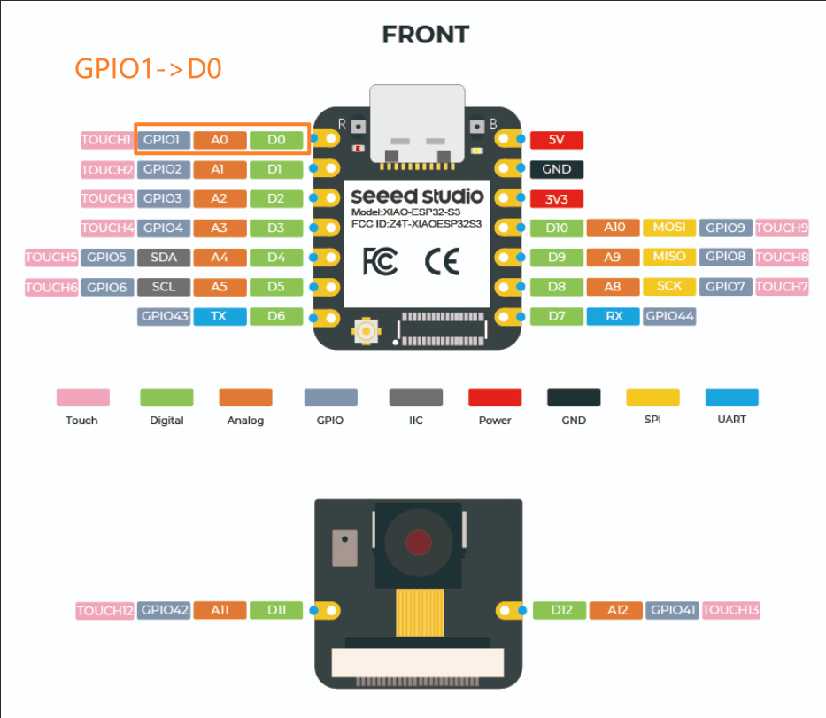

# XIAO最小Platformio工程

## 说明
为什么写这篇文章呢，因为自己发现了一个小坑，或者说是很容易忽视的问题，就是XIAO ESP32S3的引脚映射中，会出现类似GPIO1映射到D0等的这种状况，而不是GPIO0->D0，所以总是搞错，所以索性写一个最小的PIO库方便自己开发。


## 头文件
主要就是定义一个头文件，引脚定义如下：
```c
#define XIAO_ESP32S3_D0 1
#define XIAO_ESP32S3_D1 2
#define XIAO_ESP32S3_D2 3
#define XIAO_ESP32S3_D3 4
#define XIAO_ESP32S3_D4 5
#define XIAO_ESP32S3_D5 6
#define XIAO_ESP32S3_D6 43
#define XIAO_ESP32S3_D7 44
#define XIAO_ESP32S3_D8 7
#define XIAO_ESP32S3_D9 8
#define XIAO_ESP32S3_D10 9
#define XIAO_ESP32S3_D11 42
#define XIAO_ESP32S3_D12 41
```

这样之后就可以使用DX来代替引脚号啦

## 最小PIO工程下载
[点击下载最小PIO工程](./tempates_xiao_esp32s3.zip)
