# 树莓派4安装OpenWRT开启魔法
## 前言
之前是安装了LEDE，结果发现在OpenClash页面出现无法上传openclash的yaml配置文件，后来就放弃了，如果有朋友可以做到请告诉我，或者提交PR到本文章

## 步骤

### 1. 下载OpenWrt
首先去[OpenWrt的树莓派页面](https://openwrt.org/toh/raspberry_pi_foundation/raspberry_pi)进行镜像文件的烧录，我使用的是Pi4B，所以下载下图这个镜像文件：
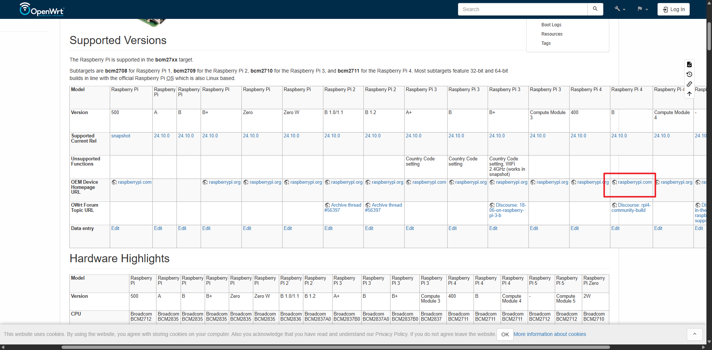
使用树莓派的烧录工具就可以，如果直接使用rufus的工具，请先对卡片进行格式化
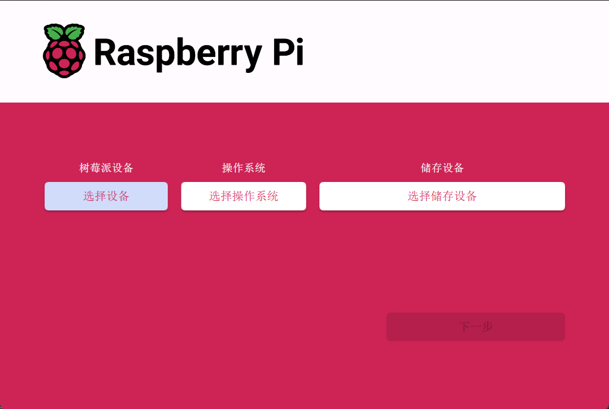

### 2. 进入后台
openWrt的默认登录地址是192.168.1.1，如果在没有外接显示器的情况下，可以使用网线将树莓派和电脑连接，然后将电脑的ip设置到同一网段，比如我设置的就是192.168.1.12
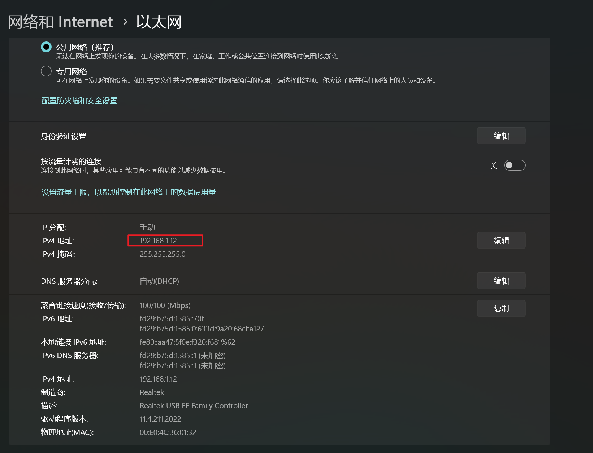

这样使用电脑浏览器输入192.168.1.1就可以登录后台了，如下，默认密码是openwrt或者为空


### 3. 树莓派配置网络

树莓派默认不是DHCP，我们将其配置为DHCP，这样我们就可以使用树莓派连接路由器进行上网，不一定需要在192.168.1.x网段，使用以下指令

```sh
uci set network.lan.proto=dhcp
uci commit
/etc/init.d/network restart
```
请记得将电脑的以太网配置重新修改为DHCP，这样我们就可以在路由器后台看到树莓派的IP啦，如下
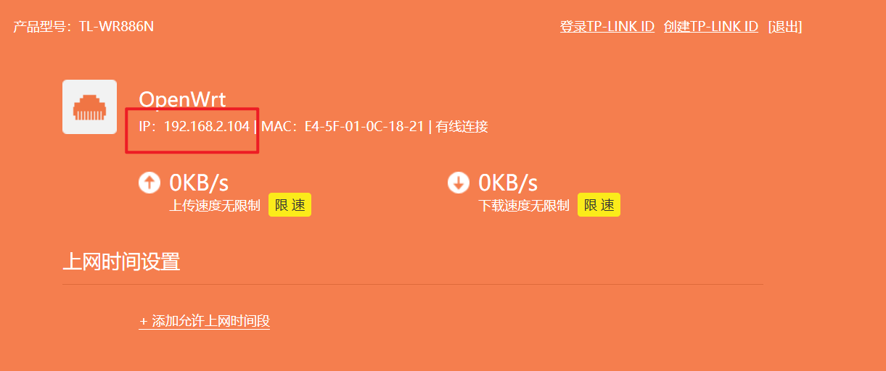

### 4. 配置scp让电脑和树莓派可以互传文件
使用以下指令

```sh
opkg update
opkg install openssh-sftp-server
```

### 5. 更换主题以及语言
我们首先确认下树莓派能不能上网，可以使用`ping www.baidu.com`可以测试，成功结果类似下面：
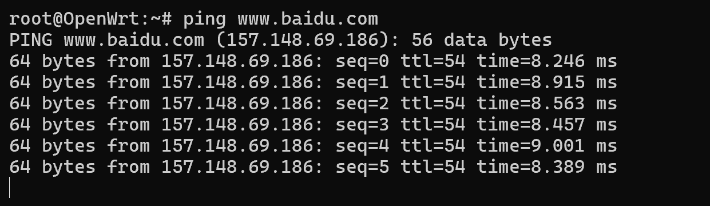
默认的OpenWrt的界面不是很好看并且是英文的，我们设置中文并且配置一个更友好的主题。首先在电脑终端使用
```sh
ssh root@192.168.1.1 #根据你自己的树莓派更换IP
```
进行连接，使用以下指令设置中文
```sh
opkg update
opkg install luci-i18n-base-zh-cn
/etc/init.d/uhttpd restart
```
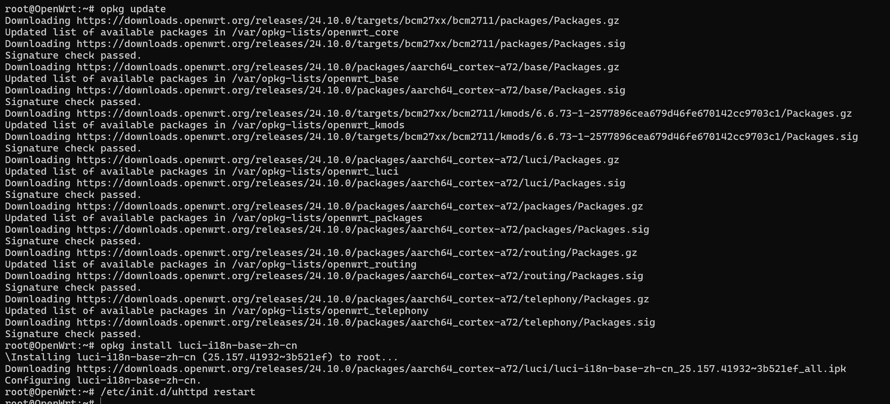

这样我们的OpenWrt就会变成中文页面了

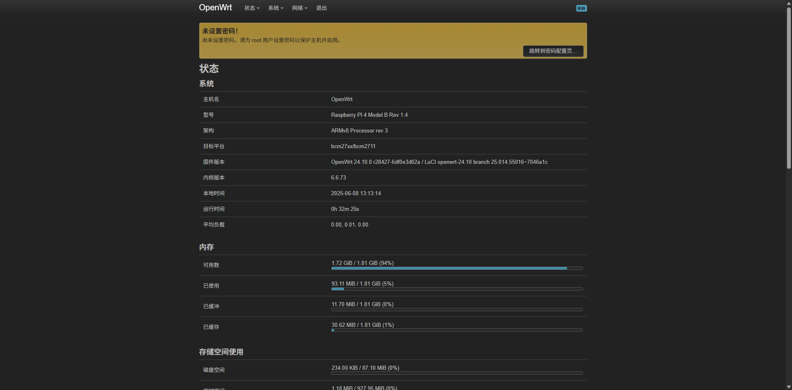

接下来我们来配置主题，本文以为`argon`为例，输入

```sh
opkg install luci-theme-argon
```

如果没有主题，可以在电脑下载，然后通过scp传输，我这里提供一个argon主题[下载](luci-theme-argon_2.3.2-r20250207_all.ipk),或者也可以去[这里](https://github.com/jerrykuku/luci-theme-argon/releases/)进行下载。

使用scp传输：

```sh
scp /path/to/luci-theme-argon_2.3.2-r20250207_all.ipk root@192.168.2.104:/tmp # 替换自己的ipk的真实路径
```

然后使用opkg进行安装

```sh
opkg install /path/to/luci-theme-argon_2.3.2-r20250207_all.ipk 
```


### 6. 安装openclash


如果在没有源的情况下，也可以手动安装openclash，我在这里提供一个下载连接：[luci-app-openclash_0.46.086_all.ipk](luci-app-openclash_0.46.086_all.ipk)，大家也可以去仓库去进行最新下载。

下载之后在电脑的终端使用scp进行传输

```sh
scp /path/to/luci-app-openclash_0.46.086_all.ipk root@192.168.2.104:/tmp # 替换自己的ipk的真实路径
```

如果出现dnsmasq-full 和系统默认 dnsmasq 包冲突问题如下
```sh
Package dnsmasq-full wants to install file ... already provided by package dnsmasq
```

请先卸载 dnsmasq，再装 dnsmasq-ful，执行以下指令：

```sh
# 1. 卸载默认 dnsmasq（系统网络短暂中断，请确认本地连接好）
opkg remove dnsmasq

# 2. 安装 dnsmasq-full（OpenClash 所需）
opkg install dnsmasq-full

# 3. 再次安装 OpenClash
opkg install ./luci-app-openclash_0.46.086_all.ipk
```

在ssh中使用
```sh
opkg install /path/to/luci-app-openclash_0.46.086_all.ipk
/etc/init.d/uhttpd restart
```
进行安装和重启，然后就可以看到openclash了


如果安装之后出现

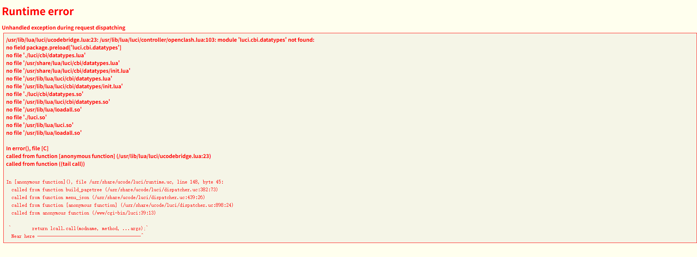

可以使用如下指令进行缺失的模块安装

```sh
opkg update
opkg install luci-compat luci-mod-admin-full
```

如果有足够空间，还可以安装如下模块

```sh 
opkg install luci luci-base luci-mod-network luci-mod-status
```

然后使用
```sh
/etc/init.d/uhttpd restart
```
进行web服务重启，如果没有出现openssh，请直接重启树莓派，重启之后就会看到openclash了
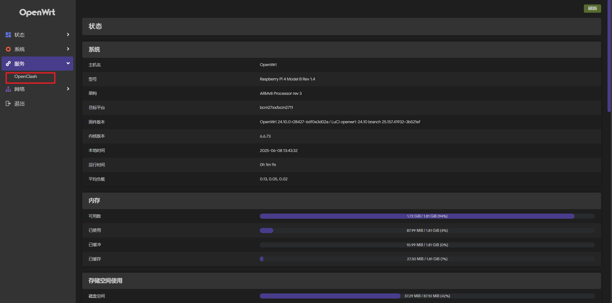
### 7.使用配置openclash服务
点击openclash服务，首次会出现安装内核提示如下
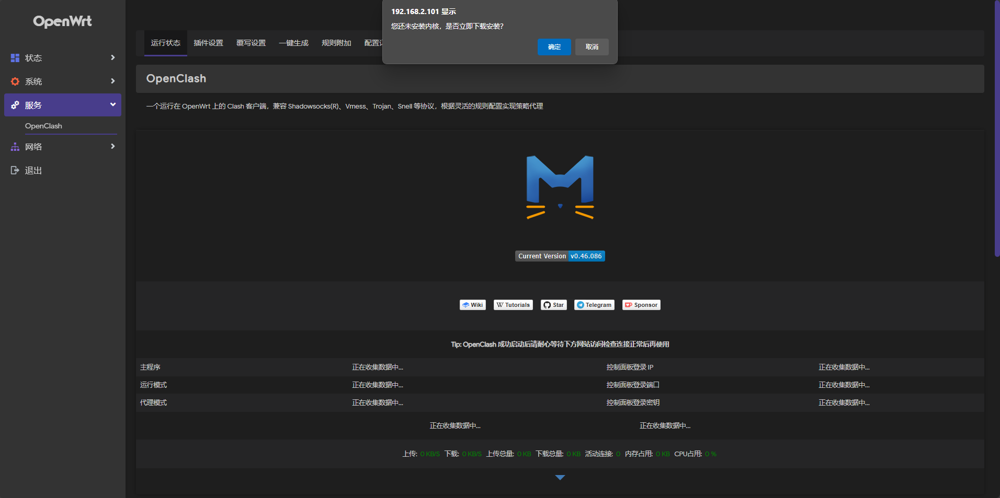
请选择cdn进行安装，如果安装失败，也可以考虑老方法，也就是使用电脑下载对应的文件，通过scp进行传输。树莓派4使用armv8架构，点击[clash_meta](clash_meta)进行下载，或者在[github](https://github.com/MetaCubeX/mihomo/releases/tag/v1.19.10)进行下载。


然后请将文件传输到服务器的`/etc/openclash/core`，然后执行如下操作（本网站文件已经更名）
```sh
cd /etc/openclash/core
gzip -d clash.meta-linux-arm64-2024.04.21.gz
mv clash.meta-linux-arm64-2024.04.21 clash_meta 
chmod +x clash_meta
ln -sf clash_meta clash
```

接着就可以上传yaml配置文件了
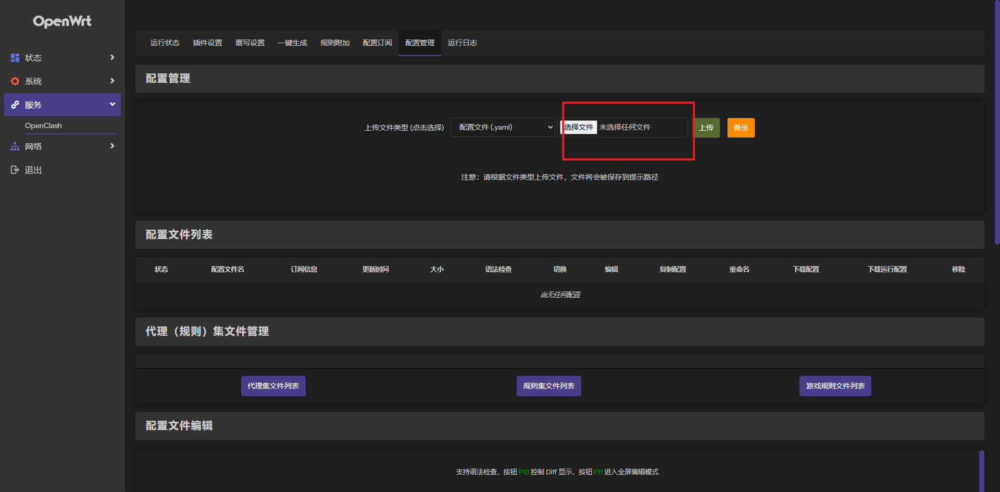

接着i其拿给点击启动openclash进行配置
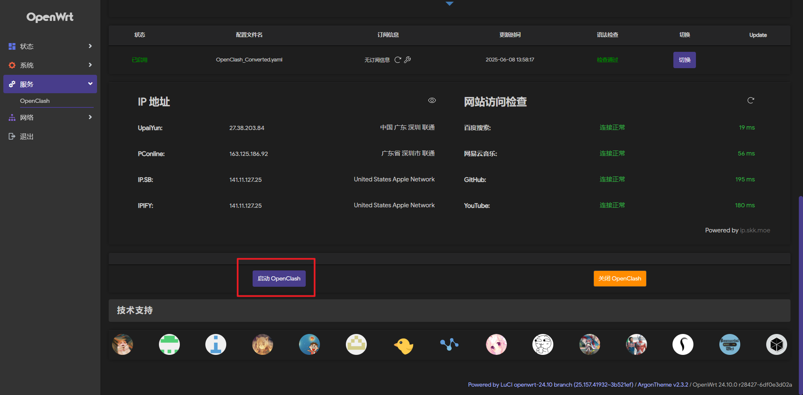