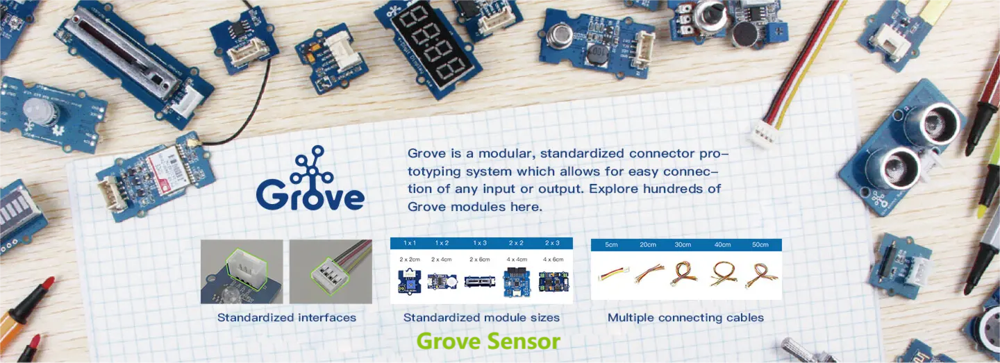

---
tags:
  - 小白
---

# 零基础小白怎么快速上手智能硬件？

## 导言
我想很多非技术行业的朋友，对DIY智能硬件都有一种陌生感，如果让你上手，你可能会说：
>“这个太难了，我不会做，🙅‍♂我不是写代码的”。

那我们作为创客社区，如何应对🧐？

一个词：屏蔽📦️

对于非专业人员，我们**屏蔽**了很多技术细节，用户不需要复杂的编程就可以实现自己想要的功能，更多的精力放到**功能设计**上面。

## 💡想法

技术易寻，但是想法难得。所有的小项目或者小DIY也好，如果涉及到硬件，那么无非就是只有三部分：输入，控制，输出。

输入对应的是各种传感器

输出对应的是各种指示设备，用于提示信息，比如显示屏，喇叭，电机等等。

其实最难的就是控制了，我们怎么去控制操作呢？接下来我们就来说说智能硬件智能在哪里？

（未完待续）